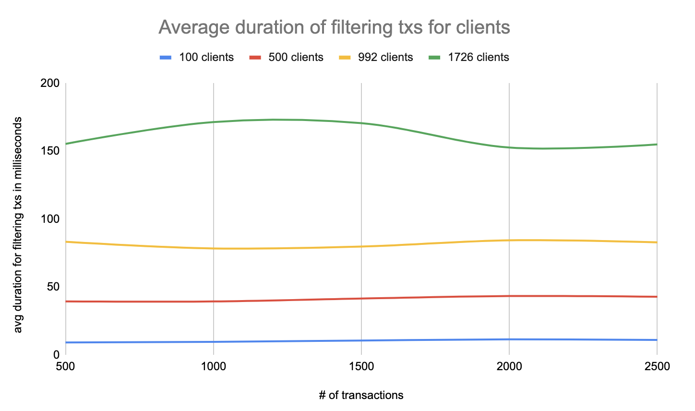

# Bloom filters

This project is a small prototype which subscribes to a stream of blocks via [Oura](https://oura.txpipe.io/), parses, transforms and filters it down to
client specified filters via a [bloom](https://github.com/Callidon/bloom-filters) filter data structure. The idea is predominantly copied from [BIP-37](https://github.com/bitcoin/bips/blob/master/bip-0037.mediawiki).
This prototype showcases how a stream of transactinos can be derived based on clients' filter preference while also collecting some metrics around
false-positives rates (FPR) and data transmitted rate (DTR).

## Goal

The goal isn't technical feasiability, but more so demonstrating limitations of this architecture with specific numbers such as:
- false-positives rate (FPR)
  > How many irrelevant transactions are forwarded to clients?
- data transmitted rate (DTR)
  > How much data is actually transmitted vs. total data processed by server?

## Run

Before running the actual pipeline, you'll need to build Oura v2 binary which is referenced as git submodule in the subdirectory `oura`. Oura v2 can be built from the `main` branch by typing the following command from inside the `oura` directory:

#### Prerequisites

```bash
cargo build --features rabbitmq --release
```

#### Steps

1. Setup rabbitMq (Oura sink):
> Run from repository root:
```bash
docker compose up
```
2. Run `server.ts` :
> This creates a websocket server while also subscribing to rabbitMq's channel to observe incoming transactions.
> Furthermore, it publishes any matches passing a hardcoded bloom filter to connected clients.

```bash
deno run --allow-net --allow-read --allow-env --allow-write src/websocket-server.ts
```

3. Open `client.html`:
> Run a local http server from this directory and open the [client html file](http://localhost:8000/client.html), which connects as websocket client to the server.
```bash
python -m http.server 8000 && chrome http://localhost:3000/client.html
```

4. Run `oura`:

Once, the build process has finished, the `oura` binary can be found in `./oura/target/release/oura`.
Now be run from the repository root directory via: 
```bash
./oura/target/release/oura daemon --config config/daemon.toml
```

## Note

Ensure you have a client connected by opening the html file, otherwise you won't see incoming transactions as the server will only subscribe to `oura`
once a client connects.


## Results & Metrics

We have collected test data based on two scenarios. All data was made available in this [spread sheet](https://docs.google.com/spreadsheets/d/1xZKOP9pRSpjLY7SWOPKUbU1015Y8fBqBqWsHNvDvuFY/edit?usp=sharing).

 ### 1. Measure tx filtering via single client connection:<br />

  All measures were done using a test wallet on mainnet with the same stream of blocks:

  - ~4783 blocks
  - ~50.000 transactions processed server-side
  - 211MB
  - with 1 Tx that is actually part of the wallet.
  
  #### FPR Comparison

  One main goal was to compare filtering txs by output address vs. credentials which can be seen in the [FPR figure](#fpr-comparison) below.

  
  
  #### BTR Comparison

  A secondary goal was to compare the difference of the bytes transferred to clients using different filter configurations.

  


### 2. Measure server capabilities for multiple client connections

In this test scenario, we used:
  
  - different number of connected clients
  - each client had a different wallet, with different UTxO set
  - each wallet has a different number of transactions
  - each test run used the same stream of blocks (2500 Txs, ~20MB Data)

We can see how the average duration of overall processing/ filtering txs by the server increase non-linearly while we increased the number of connected clients at a decreasing ratio (number of client increase / avg increase of processing duration).

#### Average duration filtering txs for # of clients



> Note:<br />
> The tests were made on a Macbook Pro 2020 2 GHz Quad-Core Intel Core i5 but not in parallel!